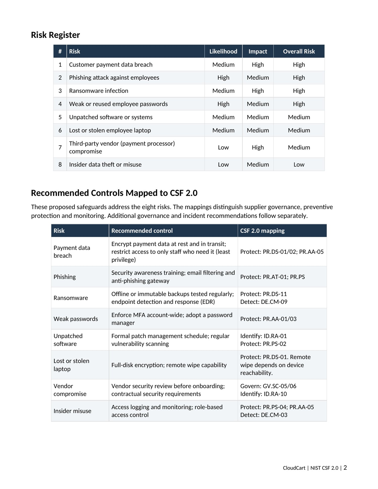

# Security Risk Assessment (GRC)

A security risk assessment for a fictional small business, built around standard risk-matrix methodology and mapped to the NIST Cybersecurity Framework (CSF).

## What This Is

Rather than a generic list of "things to be careful of," this assessment follows the structure a real GRC (Governance, Risk, and Compliance) or risk analyst would use: identify realistic risks for a specific type of business, rate each on likelihood and impact, recommend proportionate controls, and map those controls to a recognized industry framework.

## The Business

**CloudCart** (fictional): a small e-commerce business, approximately 15 employees, selling homeware online. Handles customer payment data, has a small in-house IT/development team, and works with a couple of third-party vendors (a payment processor and a hosting provider).

## Methodology

Each risk was rated on:
- **Likelihood**: how probable is this risk in practice, given the size and nature of the business
- **Impact**: how severe would the consequences be if it happened

These combine into an **Overall Risk** rating (Low, Medium, or High), a standard risk-matrix approach used across the industry.

Recommended controls for each risk are mapped to one of the five core functions of the **NIST Cybersecurity Framework (CSF)**: Identify, Protect, Detect, Respond, or Recover. NIST CSF was chosen because it is free, widely recognized across industries, and gives a shared vocabulary for discussing security posture with both technical and non-technical stakeholders.

## Risk Register

| # | Risk | Likelihood | Impact | Overall Risk |
|---|---|---|---|---|
| 1 | Customer payment data breach | Medium | High | High |
| 2 | Phishing attack against employees | High | Medium | High |
| 3 | Ransomware infection | Medium | High | High |
| 4 | Weak or reused employee passwords | High | Medium | High |
| 5 | Unpatched software or systems | Medium | Medium | Medium |
| 6 | Lost or stolen employee laptop | Medium | Medium | Medium |
| 7 | Third-party vendor (payment processor) compromise | Low | High | Medium |
| 8 | Insider data theft or misuse | Low | Medium | Low |

## Recommended Controls (Mapped to NIST CSF)

| Risk | Recommended Control | NIST CSF Function |
|---|---|---|
| Payment data breach | Encrypt payment data at rest and in transit; restrict access to only staff who need it (least privilege) | Protect |
| Phishing | Security awareness training; email filtering and anti-phishing gateway | Protect |
| Ransomware | Offline or immutable backups tested regularly; endpoint detection and response (EDR) | Protect, Recover |
| Weak passwords | Enforce MFA account-wide; adopt a password manager | Protect |
| Unpatched software | Formal patch management schedule; regular vulnerability scanning | Identify, Protect |
| Lost or stolen laptop | Full-disk encryption; remote wipe capability | Protect |
| Vendor compromise | Vendor security review before onboarding; contractual security requirements | Identify |
| Insider misuse | Access logging and monitoring; role-based access control | Detect |

Full document: [`CloudCart-Risk-Assessment.docx`](CloudCart-Risk-Assessment.docx)

## Prioritization Summary

Four risks were rated **High**: payment data breach, phishing, ransomware, and weak passwords. These represent the immediate priority given their realistic likelihood combined with severe potential impact on the business, its customers, and its regulatory obligations around payment data.

Three risks were rated **Medium**: unpatched software, lost or stolen devices, and vendor compromise. These warrant a documented remediation timeline rather than immediate emergency action.

Insider data theft was rated **Low**, reflecting its lower likelihood in a small organization, though basic access logging and monitoring are still recommended as a proportionate response rather than being left unaddressed entirely.

## What This Demonstrates

- Practical risk-matrix methodology: rating risks by likelihood and impact rather than treating everything as equally urgent
- Working knowledge of the NIST Cybersecurity Framework and its five core functions
- The ability to recommend controls that are proportionate to a business's size and risk profile, not generic enterprise-scale advice applied indiscriminately
- Communicating risk in a way that is accessible to non-technical stakeholders (a GRC/compliance hiring manager's key requirement), while still being technically grounded

## Tools Used

| Tool | Purpose |
|---|---|
| NIST Cybersecurity Framework (CSF) | Free, industry-recognized framework for structuring the risk-to-control mapping |
| Microsoft Word | Report document |

## Full Portfolio

See the complete project index: [cybersecurity-portfolio](https://github.com/RaheemC4/cybersecurity-portfolio)
